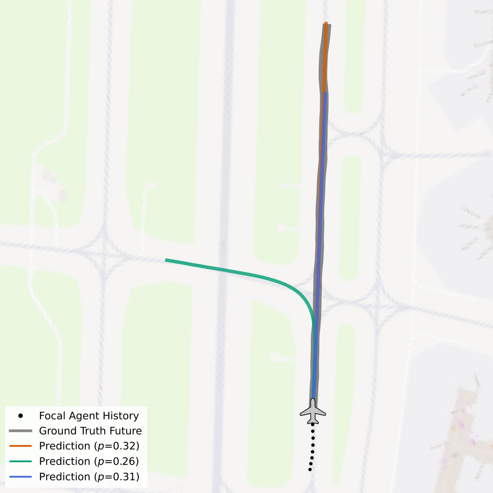
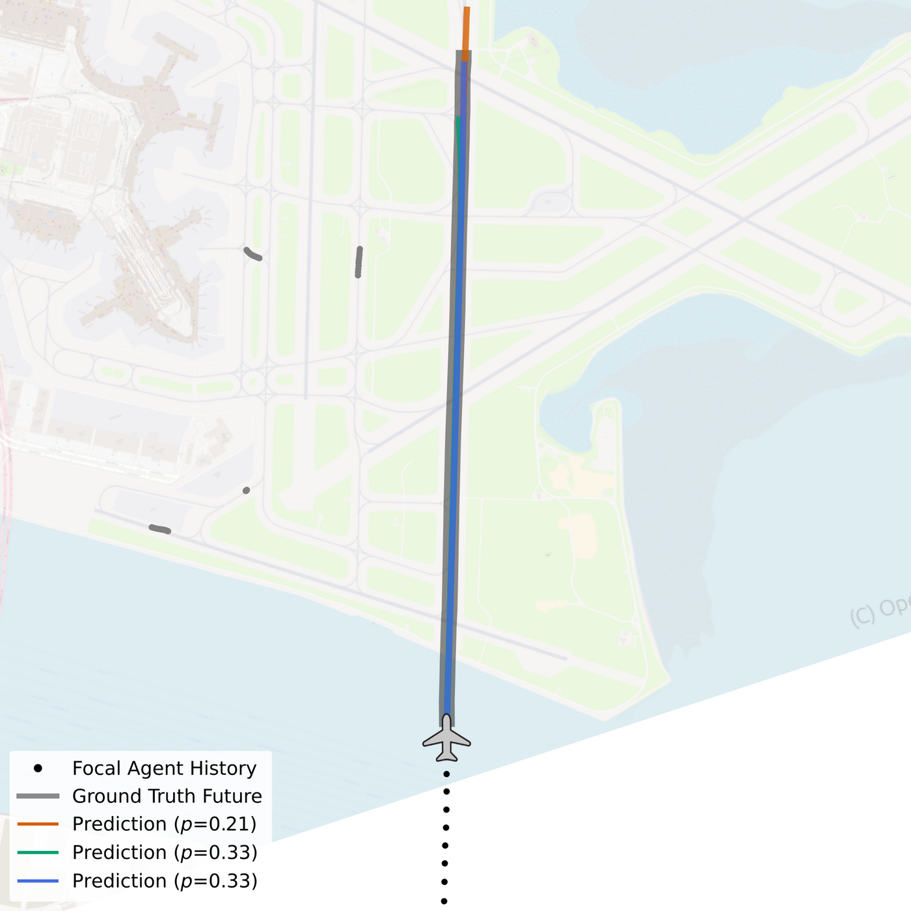
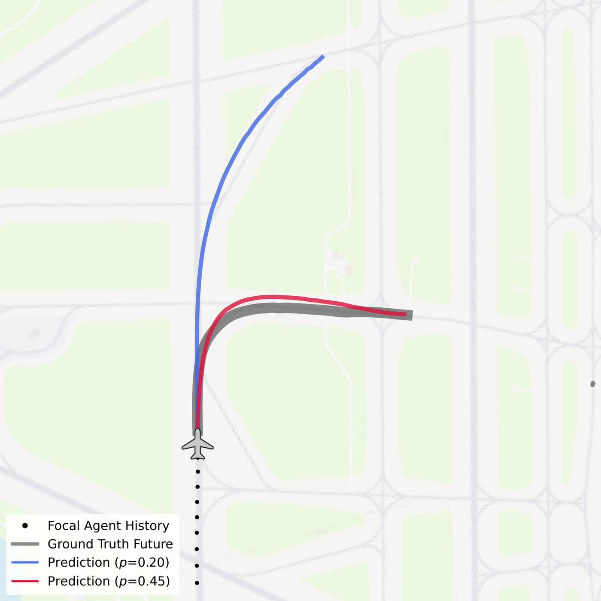

<div align="center">

# DESCENT: Directed Edge Scene Encoding for Airport Surface Movement Prediction

[](https://arxiv.org/abs/2608.26002)
[](https://a-pru.github.io/descent/)

</div>

> [**DESCENT: Directed Edge Scene Encoding for Airport Surface Movement Prediction**](https://arxiv.org/abs/2608.26002)  
> Alexander Prutsch, David Schinagl, Horst Possegger
> **Graz University of Technology**  
> **IROS 2026**

## Getting Started

### Clone the Repository
Checkpoints and maps are stored with [Git LFS](https://git-lfs.com):
```
git lfs install
git clone https://github.com/a-pru/descent.git
cd descent
```

### Create and Activate Virtual Environment
```
conda create -n descent python=3.9
conda activate descent
```

### Install PyTorch
Our implementation was developed and tested using PyTorch 2.8.0 and CUDA 12.8.

Install PyTorch e.g.
```
pip install torch==2.8.0 --index-url https://download.pytorch.org/whl/cu128
```

### Install Dependencies
```
pip install -e .
```

### Amelia-10 Dataset Setup
Download the [Amelia-10](https://huggingface.co/datasets/AmeliaCMU/Amelia-10) dataset (raw trajectories, airport assets and semantic graphs):
```
git lfs install
git clone https://huggingface.co/datasets/AmeliaCMU/Amelia-10
```

Generate the scenes with [AmeliaScenes](https://github.com/AmeliaCMU/AmeliaScenes). Its default `full` mode also stores the `critical` agent order used by DESCENT. AmeliaScenes pins `torch==2.4.0`, so we recommend a separate environment for this one-time preprocessing step:
```
conda create -n amelia_scenes python=3.9
conda activate amelia_scenes
git clone https://github.com/AmeliaCMU/AmeliaScenes.git
cd AmeliaScenes
pip install -e .
mkdir -p datasets && ln -s /path/to/Amelia-10/data datasets/amelia
python amelia_scenes/run_processor.py presets=amelia_10
```
The scenes are written to `Amelia-10/data/traj_data_a10v08/proc_full_scenes`. The train/val/test splits do not need to be created; they are part of this repository (see below).

Finally, link the dataset into this repository (or pass `paths.base_dir=<path>` to any command):
```
cd /path/to/descent
mkdir -p datasets && ln -s /path/to/Amelia-10/data datasets/amelia
```
The code expects this layout:
```
datasets/amelia/
├── traj_data_a10v08/
│   └── proc_full_scenes/<airport>/<shard>/<idx>_n-<num_agents>.pkl
├── assets/<airport>/{bkg_map.png,limits.json}        # visualization only
└── graph_data_a10v01os/<airport>/semantic_graph.pkl  # map generation only
```

### Data Splits
The `splits` folder contains the day-based train/val/test splits (lists of hour shards per airport) used for all experiments in the paper. They are read from `paths.splits_dir`, which defaults to this folder.

### Directed Lane Maps
The `maps` folder contains the directed lane maps and lane distance fields (SDFs) of all 10 airports.
To rebuild them from the Amelia-10 semantic graphs:
```
python scripts/generate_maps.py --airports kbos ksfo --out-dir maps
```

## Training
Train a single-airport model (`data=kbos`, ...) or the multi-airport model (`data=seen-all`):
```
python scripts/train.py data=kbos
```
For each run, a new directory is created in `out/logs/train/runs/` containing checkpoints, split files, logs and the resolved config. After training, the best checkpoint is evaluated on the test split.  
All parameters are Hydra configs in `configs/` and can be overridden from the command line, e.g. to reduce memory use:
`data.extra_params.num_workers=2 data.extra_params.prefetch_factor=1 data.extra_params.persistent_workers=false`

## Evaluation
### Pretrained Models
We provide the checkpoints of all single-airport models (paper Tables I and II) and of the multi-airport model (Table III) in the `checkpoints` folder. `scripts/eval.py` loads `checkpoints/<airport>.ckpt` by default.

Evaluate on the most critical agent of each scenario (Table I):  
`python scripts/eval.py data=kbos data.dataset.config.random_ego_agent=false`

Evaluate on a random agent of each scenario (Table II):  
`python scripts/eval.py data=kbos data.dataset.config.random_ego_agent=true`

Evaluate the multi-airport model (Table III):  
`python scripts/eval.py data=kbos ckpt_path=checkpoints/seen-all.ckpt`

Expected results of the released checkpoints on the full test sets (minADE / minFDE over 4 modes, in meters):

| Airport | Agent | mADE@20s | mFDE@20s | mADE@50s | mFDE@50s |
| :--- | :--- | :--- | :--- | :--- | :--- |
| KBOS | critical | 7.32 | 14.25 | 26.80 | 64.49 |
| KBOS | random | 5.57 | 10.41 | 18.35 | 42.23 |
| KSFO | critical | 6.49 | 12.39 | 23.22 | 56.60 |
| KSFO | random | 4.93 | 9.13 | 15.81 | 37.10 |
| PANC | critical | 8.06 | 15.45 | 28.42 | 67.17 |
| PANC | random | 6.52 | 12.22 | 20.35 | 44.14 |

Keep the default `batch_size=128`: the test loader drops the last incomplete batch, so the batch size changes which scenes are scored.

Note: this release contains a cross-run stability fix. The paper code computed relative agent histories with an in-place subtraction that is nondeterministic on the GPU; the released code is deterministic. The fix changes the results only minimally: on the airports above, all metrics are within 0.04 m of the paper.

### Custom Runs
To evaluate a custom model, pass its checkpoint:  
`python scripts/eval.py data=kbos ckpt_path=out/logs/train/runs/2026-XX-XX_XX-XX-XX/checkpoints/last.ckpt`

## Visualization
Visualize KBOS prediction results on the airport map:  
`python scripts/visualize.py data=kbos vis.num_scenes=16`

The figures are written to `out/logs/visualize/runs/<timestamp>/figures/` and show the focal agent's history, the ground-truth future, the PRS lane segments and the predicted modes. Example predictions at KBOS:

<table align="center">
  <tr>
    <td></td>
    <td></td>
    <td></td>
  </tr>
</table>

## Bibtex
```bibtex
@inproceedings{prutsch2026descent,
    title={{DESCENT: Directed Edge Scene Encoding for Airport Surface Movement Prediction}},
    author={Prutsch, Alexander and Schinagl, David and Possegger, Horst},
    booktitle={Proceedings of the IEEE/RSJ International Conference on Intelligent Robots and Systems},
    year={2026}
}
```

## Acknowledgements
This repository is based on [AmeliaTF](https://github.com/AmeliaCMU/AmeliaTF) and uses the [Amelia-10](https://ameliacmu.github.io) dataset. We thank them for their work!
